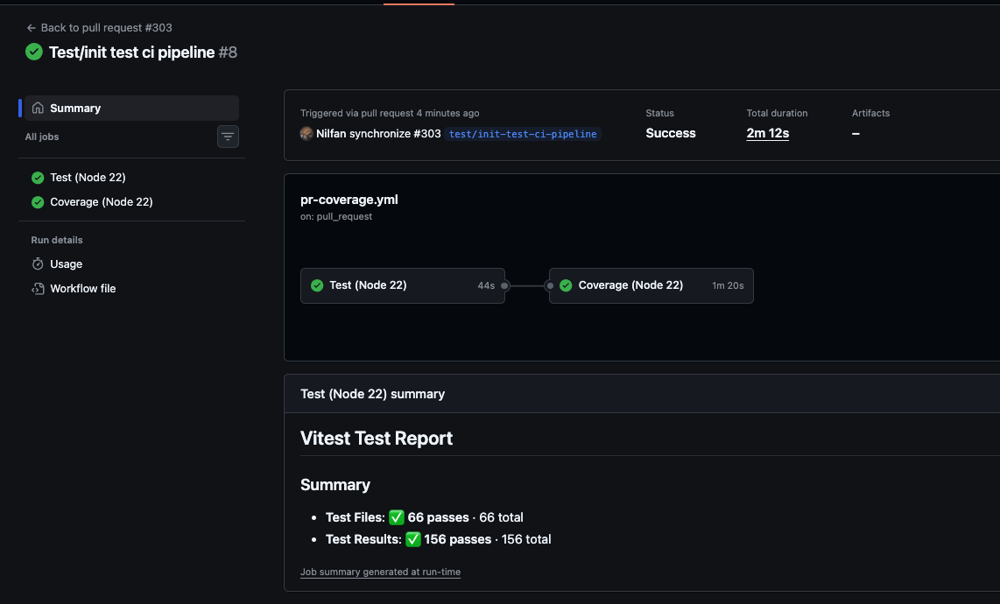
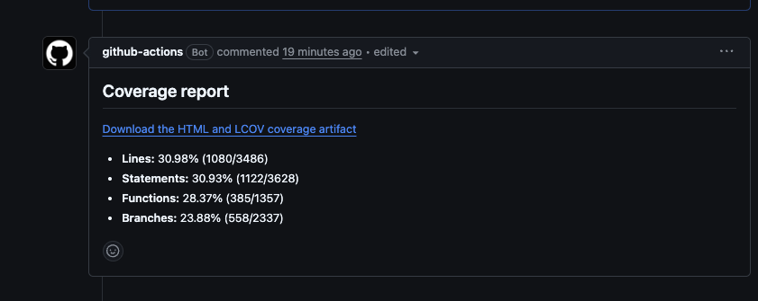

# CI-пайплайн для pull request

Workflow для pull request в [`.github/workflows/pr-coverage.yml`](.github/workflows/pr-coverage.yml) — это ранний контроль качества: каждый PR должен пройти unit-тесты до формирования отчёта о покрытии. Так ошибки тестов видны до ревью или слияния, а сведения о покрытии остаются привязанными к PR.

## Как это работает

Workflow запускается на каждом `pull_request`, использует Node.js 22 и кэш npm:

1. **Test (Node 22)** получает код ветки, устанавливает зависимости из lockfile через `npm ci`, затем запускает [`test:run`](package.json:14) (`vitest run`).
2. **Coverage (Node 22)** начинается только после успешного test job (`needs: test`). Он заново выполняет `npm ci`, запускает [`test:coverage`](package.json:15) (`vitest run --coverage`), создаёт сводку и загружает отчёт. Шаги сводки и артефакта также выполняются при ошибке команды покрытия, если файлы доступны.

## Сводка покрытия и артефакт

Для PR из веток этого репозитория workflow создаёт или обновляет один комментарий бота с заголовком **Coverage report**. В нём указаны **Lines**, **Statements**, **Functions** и **Branches**: процент и количество покрытых/всех элементов. В комментарии есть ссылка [Download the HTML and LCOV coverage artifact](../../actions/runs/<run-id>#artifacts) на артефакт запуска. Артефакт называется `pr-<номер-PR>-coverage`, содержит HTML-отчёт и `lcov.info` и хранится 14 дней.

## Вопросы и известные проблемы

**Почему `npm ci` завершается ошибкой, если lockfile не синхронизирован?**  `npm ci` намеренно требует точного соответствия [`package-lock.json`](package-lock.json) и [`package.json`](package.json). После изменения зависимостей заново сгенерируйте и закоммитьте lockfile; не заменяйте установку в CI на `npm install`.

**Ломают ли CI предупреждения `EBADENGINE` от устаревших зависимостей?**  Нет. Сейчас это нефатальные предупреждения совместимости от транзитивных legacy-зависимостей. Их следует отслеживать и устранять обновлением зависимостей, когда это возможно.

**Что стало с прежней schema error при создании summary?**  Сводка больше не зависит от схемы репортера. Workflow читает `coverage/coverage-final.json` и сам вычисляет показатели lines, statements, functions и branches, поэтому эта ошибка не возникает.

**Почему для PR из fork нет комментария о покрытии?**  Шаг комментария намеренно пропускается для fork PR. Это сохраняет ограниченные права и не передаёт токен с правом записи недоверенному коду из fork; источником отчёта остаются запуск workflow и его артефакт.
